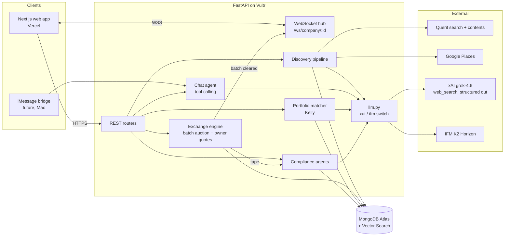
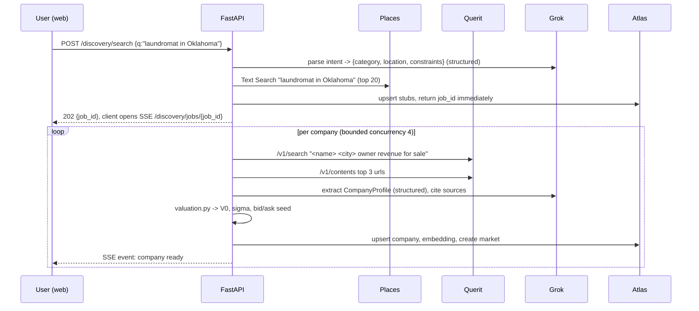

# JB: Plan.md

**HackCMU 2026 (Sep 11 to 12). Hacking starts Fri 9:00 PM, submissions due Sat 4:00 PM EDT (19 hours).**
**Team: Nico, Vir, Aditya, Zhiyuan.**

One line pitch: *a discovery engine and exchange for the businesses that will never be listed: laundromats, car washes, family manufacturers. Search them like Google, price them like a stock, buy a fraction like Robinhood, acquire them like a PE firm.*

This document is the steering doc. Every decision that changes an interface goes in `docs/DECISIONS.md` (see section 9). Everything in section 1 was checked against live sources on Sep 11, 2026; anything not verified is listed in 1.4.

---

## 0. Contents

1. What we know for certain (validated facts, tracks, prizes, sponsor APIs)
2. Which tracks and prizes to target, and why
3. Product: the two phases, user flows, screens
4. Stack, end to end
5. Architecture and network diagram
6. Data model (MongoDB)
7. API contract (the thing all four of us build against)
8. Pricing and market design (valuation ensemble, batch auction, owner liquidity, Kelly, anti arbitrage)
9. Agents, Grok integration, compliance surveillance
10. Splitting the work four ways
11. Hour by hour timeline
12. Agent to agent coordination across our four machines
13. Demo script (3 minutes)
14. Risks and cut lines

---

## 1. What we know for certain

### 1.1 Event facts (source: `HackCMU 2026 Opening Ceremony.pdf`, devpost pages)

| Fact | Value |
|---|---|
| Format | 24h, teams up to 4, "must be from scratch", any language or AI allowed |
| Hacking window | Fri 9:00 PM to Sat 4:00 PM (submit via Google form, plus Devpost) |
| Tracks | **Optimization**, **Traveling**, **Multiplayer**, **Food**, **IFM (optional)** |
| Track rule | Pick exactly one at submission, 50 word explanation. Relevance to track is a judged criterion |
| Judging criteria | Originality, Technical Difficulty ("real technical challenges vs ChatGPT wrapper"), Demo Quality (under 3 min), Usefulness, Relevance (track only) |
| Judging format | 3 min presentation + demo, 3 rooms of judges, expo tables |
| Prize categories | Grand (HRT poker set), Track 1st/2nd/3rd, IFM (Kindle), Cursor (Cursor keyboards), Sandia Cybersecurity (AirPods), People's Favorite, Best Design (Fujifilm), MLH: Gemini, ElevenLabs, Solana, Vultr, Auth0, MongoDB Atlas |
| Mentors | Live OH Sat 10am to 1pm TEP Simmons B, Discord tickets all night (fullstack, mobile, ML, cloud) |
| Workshops tonight | IFM workshop 9 to 10 PM TEP 1403 (K2 models). Cursor workshop 10 to 10:30 PM TEP 1403 (Cursor, Grok Imagine, Grok Bot) |
| Sponsors tabling | IFM, SpaceXAI (Grok, and per the slide, the company behind Cursor), Sandia, Querit, MLH |
| Discord | https://discord.com/invite/HP4BhW3hnp (slides posted there) |
| Schedule | https://www.acmatcmu.com/hackcmu2026/ |

Note on the rule "not permitted to start building or designing until the event": the event began at check in (5 PM). This plan was written after the opening ceremony. Keep all commits timestamped after 9 PM.

### 1.2 Sponsor APIs, validated

**Querit (web search for agents). This is the "query API" from the slide.**
- Docs: https://www.querit.ai/en/docs/overview/quickstart. SDK: `pip install querit` (https://github.com/querit-ai/querit-python). MCP server: https://github.com/querit-ai/querit-mcp
- Free tier: 1,000 searches/month, 1 QPS, no card. Paid: $4 per 1k searches, $1 per 1k pages.
- `POST https://api.querit.ai/v1/search`, header `Authorization: Bearer KEY`, body `{"query": "...", "count": 5, "filters": {"language": "english"}}`. Other params seen in the MCP tool: `include_domains`, `exclude_domains`, `date_range`, `countries`, `chunks_per_doc`, `include_content`.
- `POST https://api.querit.ai/v1/contents`, body `{"urls": [...], "format": "text|markdown|html", "crawlTimeout": 30, "extrasMeta": true}` (1 to 10 URLs per call).
- Response: `results[]` with `title`, `url`, `snippet`, page age, site name.

**xAI Grok API.**
- Base URL `https://api.x.ai/v1`, OpenAI compatible (use the `openai` Python/TS SDK with `base_url`), plus the `xai_sdk` package.
- Model to use: `grok-4.6` (500k context, $2 in / $6 out per 1M, $0.50 cached). Cheaper option if we burn credit: `grok-4.3` ($1.25 / $2.50).
- Responses API with server side tools: `tools=[{"type": "web_search", "filters": {"allowed_domains": [...max 5]}}]` and `{"type": "x_search"}`. Citations come back on the response (see Citations page in docs).
- Structured outputs: `chat.parse(PydanticModel)` in `xai_sdk`, or `response_format` JSON schema through the OpenAI client. Limits: 64 properties per object, 256 array items, 2,048 char strings.
- Also available if we want flair: Grok Imagine (images $0.04 each), voice API.

**IFM K2 Horizon (for the IFM prize).**
- Six Apache 2.0 models: 375B-A23B (MoE, 23B active, 512k context), 36B-A4B, 32B, 7B, 3.7B, 0.9B. Hugging Face org `IFM`.
- Served through partners (Cerebras, Nebius, AWS, Compass) with an OpenAI compatible chat endpoint; tool calling supported (json / xml formats via `chat_template_kwargs`); reasoning returned in `reasoning_content`.
- **Action tonight: one of us attends the 9 PM IFM workshop and gets the endpoint + key.** Everything LLM related in our code goes through one `llm.py` with a provider switch so K2 can take any role (see 9.4).

**MLH sponsors (each is a separate prize, cheap to qualify for).**
- MongoDB Atlas: free M0 cluster, $50 student credit at https://mlh.link/mongodb. Prize needs "a hack built on Atlas". We use Atlas + Atlas Vector Search.
- Auth0: https://mlh.link/auth0-signup, free to 7,000 users, no card. Prize needs "use any Auth0 API". One hour of work with the Next.js SDK.
- Vultr: https://mlh.link/vultr, free credits. Prize needs the hack deployed on Vultr. We deploy the API there.
- Gemini, ElevenLabs, Solana: skip (Gemini conflicts with the Grok story; Solana tokenized shares is a stretch idea only).

**Business data sources for discovery (validated).**
- Google Places API (New) Text Search: 5,000 free calls/month on Pro SKU, 10,000 on Essentials. Gives name, address, rating, review count, hours, phone, website. Best structured source for "laundromats in Tulsa, OK".
- Yelp Fusion: free tier is gone, 30 day trial with 5,000 calls. Backup only.
- BizBuySell (no API; use Querit search to find listings and Querit contents to read them). Public benchmarks for the valuation anchor: overall small business median sale price $349,250, cash flow (SDE) multiple 2.7x, revenue multiple 0.7x (Q2 2026 Insight Report). Laundromats 3x to 5x SDE single store, margins around 38%. Source pages: https://www.bizbuysell.com/learning-center/industry-valuation-multiples/ and https://www.bizbuysell.com/learning-center/valuation-benchmarks/laundromats-coin-laundry/

### 1.3 Market design references we are relying on (well known results, cited so the judges hear them)
- Frequent batch auctions: Budish, Cramton, Shim (2015), "The High-Frequency Trading Arms Race: Frequent Batch Auctions as a Market Design Response", QJE. Uniform price call auction every T seconds removes latency arbitrage and works with thin books.
- Precision weighted combination of estimates (normal-normal Bayesian update, the same step a Kalman filter takes) for the valuation ensemble and the in market belief update.
- Hedonic / comparable sales pricing (the method behind real estate AVMs) as the calibration target: scraped listings with asking prices.
- Avellaneda and Stoikov (2008) and Hanson's LMSR (2003) were considered for a platform run market maker; moved to Backlog.md (see 8.1).
- Kelly (1956), and fractional Kelly for position sizing. Continuous form f* = mu / sigma^2.

### 1.4 Not yet verified (check at the venue, first hour)
- Whether xAI gives hackathon credits (ask at the SpaceXAI table). Otherwise one of us puts $10 on a key; the whole hackathon costs under $5 at grok-4.6 prices.
- Exact IFM endpoint and key (workshop at 9 PM).
- Exact Cursor prize criteria (likely "built with Cursor"; ask at the table, and keep Cursor open on at least two machines with the repo).
- Sandia prize criteria (cybersecurity). Our surveillance agents and audit log are a plausible entry; ask what they want to see.
- xAI does not appear to offer an embeddings endpoint. Plan assumes local `sentence-transformers` (all-MiniLM-L6-v2, 384 dims) for company embeddings. Confirm at hack time; Gemini `text-embedding` is the fallback.
- Google Places needs a billing account attached even for free calls. One person sets this up with a personal card and a $5 budget cap.

---

## 2. Track and prize strategy

**Primary track: Optimization.** The core of the technical story is optimization at three levels:
1. The exchange clears each batch at the uniform price that maximizes executed volume (a 1D optimization solved exactly over the order book).
2. The initial price is a precision weighted Bayesian ensemble of independent estimators, with uncertainty inflated by their disagreement, calibrated on real listings.
3. The portfolio builder sizes positions by maximizing expected log growth (Kelly) subject to budget and concentration limits, and matches companies to a user by vector similarity.

50 word track blurb (draft): *Small businesses have no price. We built an exchange that optimizes one: a frequent batch auction that clears each round at the volume maximizing price, a calibrated Bayesian valuation ensemble that sets the opening price and the owner's quotes, and a Kelly optimal portfolio builder that matches buyers to fractional stakes in businesses they discover.*

**Backup track: Multiplayer.** If, at 2 PM Saturday, the Optimization track looks crowded (ask organizers on Discord how many submissions per track), switch to Multiplayer. The exchange is inherently multiplayer; the demo where judges bid from their phones and watch the price clear works for either. Do not change the product; only change the 50 words.

**Sponsor prizes we are going for, in priority order:**
1. Cursor / SpaceXAI prize: Grok is doing real work in the app (extraction, valuation narrative, compliance reasoning, agent chat), and the code is written in Cursor.
2. IFM prize: K2 acts as the independent second reviewer in compliance and valuation (section 9.4). Real use, not decoration.
3. MongoDB Atlas: primary DB plus Atlas Vector Search for matching.
4. Auth0: login.
5. Vultr: API is deployed there.
6. Best Design: the frontend owner treats this as a goal from hour one.
7. Sandia Cybersecurity: audit log, surveillance agents, wash trade and spoofing detection. Pitch it if the table says it fits.

---

## 3. Product

### 3.1 The two phases

**Phase 1, Discover.** "I want a laundromat in Oklahoma." The pipeline finds real businesses (Places + Querit), reads about them (Querit contents + Grok web_search), extracts a structured profile (Grok structured output), estimates value with a distribution (section 8.2), and lists them with a bid, an ask, and a confidence. Each company page shows: what it does, founders/owners, location, estimated revenue and SDE with sources, valuation range, the live order book, price history, and an "Acquire" button.

**Phase 2, Trade and Acquire.** Every listed company is split into 10,000 shares. Users place limit orders (fractional allowed, 0.01 share min). A batch auction clears every 10 seconds (demo setting; 30s to 60s in "real" mode). The owner's ask ladder and buyback floor, both derived from the valuation posterior, guarantee there is always a bid and an ask; the platform never trades. "Acquire" opens a flow: a Grok drafted letter of intent and a due diligence checklist specific to the state and business type with citations. A portfolio tab suggests other stakes with Kelly sized amounts. A surveillance panel shows what the compliance agents flagged this session.

### 3.2 Screens (Next.js routes)

| Route | Purpose | Key components |
|---|---|---|
| `/` | Landing + search bar ("laundromat in Oklahoma") + trending companies | SearchBar, TrendingGrid |
| `/search?q=` | Results list with bid / ask / last / confidence, filters (state, category, price band) | ResultCard, FilterRail, progress stream while the pipeline runs |
| `/company/[id]` | Profile, valuation with sources, order book, chart, order ticket, acquire button | ProfileHeader, ValuationCard (range bar), OrderBook (live), PriceChart, OrderTicket, SourcesList |
| `/company/[id]/acquire` | LOI draft, DD checklist | LoiEditor, ChecklistAccordion |
| `/portfolio` | Holdings, P&L, Kelly suggestions, "build me a portfolio" | HoldingsTable, SuggestionCards, RiskSlider |
| `/surveillance` | Flags feed, per batch summary, audit log search | FlagsFeed, BatchTimeline |
| `/agent` | Chat with the discovery/trading agent (same backend the iMessage bridge will use) | Chat, tool call cards |

Design direction for the Best Design prize: one accent color, dark trading UI for company pages, light editorial UI for discovery, monospace numerals, no stock photos. Bid in green, ask in red, clearing price in the accent color, and the countdown to next batch always visible on the company page.

---

## 4. Stack

Chosen for: four people in parallel, 19 hours, Python for the quant code, a UI that can win Best Design, sponsor prizes with near zero extra cost.

| Layer | Choice | Why |
|---|---|---|
| Frontend | Next.js 15 (App Router), TypeScript, Tailwind, shadcn/ui, `lightweight-charts` (TradingView) for price, Recharts for the rest | Fast to build, looks good by default, Vercel deploy in minutes |
| Auth | Auth0 via `@auth0/nextjs-auth0` | MLH prize, one hour |
| API | Python 3.12, FastAPI, Pydantic v2, `uvicorn`, WebSockets | Quant code (numpy, scipy) lives in Python; one process, one deploy |
| Realtime | FastAPI WebSocket endpoint, in process pub/sub (one uvicorn worker) | No Redis needed for a demo |
| DB | MongoDB Atlas M0, `motor` (async driver), Atlas Vector Search index on `companies.embedding` | Team's choice; MLH prize; vector search is built in |
| LLM | `openai` SDK pointed at `https://api.x.ai/v1` (grok-4.6), and at the IFM K2 endpoint. One `llm.py` with `provider="xai" \| "ifm"` | OpenAI compatible on both sides |
| Search | Querit (`querit` SDK) for web search + page contents; Google Places (New) Text Search for structured business listings | Sponsor API plus the best free structured source |
| Embeddings | `sentence-transformers` all-MiniLM-L6-v2 (local, 384 dims) | No key, no cost; fallback Gemini embeddings |
| Deploy | Frontend on Vercel; API on a Vultr VPS (Docker, `docker compose up`) | Vultr prize; Vercel is free |
| Repo | Monorepo `JB/` with `apps/web`, `apps/api`, `packages/contracts`, `docs/` | One clone, one CLAUDE.md, one contract folder |
| Dev tooling | Cursor on every machine, Claude Code on every machine, `uv` for Python, `pnpm` for web | Cursor prize; agents coordinate through the repo (section 12) |

Repo layout:

```
JB/
  CLAUDE.md                  # loaded by every Claude Code session; points to docs/
  .cursor/rules/steering.mdc # same content for Cursor
  docs/
    STEERING.md              # this plan, kept current
    DECISIONS.md             # append only decision log (who, when, what changed, who is affected)
    API.md                   # generated from FastAPI /openapi.json
  packages/contracts/
    openapi.yaml             # frozen at 11:30 PM Friday; changes need a DECISIONS entry
    types.ts                 # generated with openapi-typescript
  apps/api/
    app/main.py
    app/llm.py               # provider switch: xai | ifm
    app/routers/{discovery,companies,market,portfolio,acquire,agent,surveillance}.py
    app/services/discovery/  # querit.py places.py extract.py valuation.py benchmarks.py
    app/services/market/     # auction.py treasury.py kelly.py book.py (persistence)
    app/services/agents/     # compliance.py portfolio_agent.py chat_agent.py
    app/db.py
    seeds/                   # cached discovery results so the demo never waits on the network
    tests/                   # auction and Kelly unit tests (cheap, and judges like seeing them)
  apps/web/                  # Next.js
  scripts/
    demo_pricing.py          # runs the valuation ensemble + a 6 round auction sim, no keys needed
    imessage_bridge.py       # future: Mac chat.db poller + osascript sender
```

---

## 5. Architecture



Request flow for a search:



---

## 6. Data model (MongoDB)

```
users        { _id, auth0_sub, name, cash: 100000, risk_profile: {tolerance, horizon, sectors[], states[], budget}, created_at }
companies    { _id, name, category, naics_guess, address, city, state, lat, lng, website, phone,
               rating, review_count, founded_year, owners[], description,
               financials: { revenue_est, sde_est, margin_est, employees_est, confidence 0..1, method },
               valuation: { v0, sigma, low, high, method, disagreement, estimates: [{name, value, sigma, note}], as_of },
               sources[]: { url, title, snippet, fetched_at },
               embedding: [384 floats], status: "stub"|"ready"|"failed", created_at }
markets      { _id: company_id, shares_outstanding: 10000, float: 3000, retained: 7000, tick: 0.01, last_price, ref_price,
               belief: { mu, sigma, s_m, n_rounds },
               batch_interval_s: 10, next_batch_at, band_pct: 0.10,
               treasury: { unsold_float, proceeds, floor_price, floor_qty, bought_back, ask_ladder: [{price, qty}] },
               fees_collected, halted: false }
orders       { _id, market_id, user_id, side: "buy"|"sell", qty, limit_price, status: "open"|"filled"|"partial"|"cancelled",
               filled_qty, created_at, cancelled_at, origin: "user"|"treasury"|"bot"|"agent" }
batches      { _id, market_id, t, clearing_price, volume, imbalance, n_buy, n_sell, book_snapshot: {bids[], asks[]} }
trades       { _id, market_id, batch_id, buyer_id, seller_id, qty, price, t }
positions    { _id, user_id, market_id, qty, avg_cost }
acquisitions { _id, market_id, user_id, loi_md, checklist[], status }
flags        { _id, market_id, batch_id, rule, severity, subjects[], explanation, reviewer: "rules"|"grok"|"k2", t }
audit_log    { _id, t, actor, action, payload_hash, payload }   # append only, never updated
```

Indexes: `companies` text index on `name, description, category`; vector index `company_vec` on `embedding` (cosine, 384); `orders` on `(market_id, status)`; `trades` on `(market_id, t)`.

---

## 7. API contract (freeze by 11:30 PM Friday)

All JSON, all under `/api/v1`. Auth: Auth0 access token in `Authorization: Bearer` on anything that writes. Demo mode flag `DEMO_AUTH=1` accepts `X-Demo-User: <name>` so judges can trade from phones without logging in.

**Discovery**
- `POST /discovery/search {q}` -> `202 {job_id, intent}`
- `GET /discovery/jobs/{id}` (SSE) -> events `company_ready {company}`, `done`
- `GET /companies?state=&category=&q=&sort=` -> `[CompanyCard]`
- `GET /companies/{id}` -> `Company` (profile + valuation + sources + market summary)
- `POST /companies/{id}/refresh` -> rerun extraction (admin)

**Market**
- `GET /markets/{id}/book` -> `{bids:[{price,qty}], asks:[...], last, ref, next_batch_at, band}`
- `POST /markets/{id}/orders {side, qty, limit_price}` -> `Order`
- `DELETE /orders/{id}`
- `GET /markets/{id}/batches?limit=` -> `[Batch]` (price history)
- `GET /markets/{id}/trades?limit=`
- `WS /ws/markets/{id}` -> pushes `book`, `batch`, `trade`, `flag` events

**Portfolio**
- `GET /portfolio` -> `{cash, positions[], pnl}`
- `PUT /portfolio/profile {tolerance, horizon, sectors[], states[], budget}`
- `POST /portfolio/suggest` -> `[{company, edge, sigma, kelly_fraction, suggested_usd, why}]`

**Acquire**
- `POST /acquire/{company_id}/start` -> `{acquisition_id, loi_md, checklist[]}`
- `POST /acquire/{id}/chat {message}` -> streamed reply (edits LOI, answers DD questions, cites)

**Agent**
- `POST /agent/chat {session_id, message}` -> streamed reply; tools: `search_companies`, `get_company`, `get_book`, `place_order`, `suggest_portfolio`. Same endpoint the iMessage bridge calls later.

**Surveillance**
- `GET /surveillance/flags?since=`
- `GET /surveillance/audit?actor=&since=`

Pydantic models live in `apps/api/app/schemas.py`; `packages/contracts/openapi.yaml` is exported from `/openapi.json`; `types.ts` generated with `pnpm openapi-typescript`. If you change a schema, regenerate both and add a line to `docs/DECISIONS.md`.

---

## 8. Pricing and market design

The problem: 56 bidders (or fewer) per asset, no history, no fundamentals on file. A continuous limit order book would be empty most of the time and trivially manipulable. Design principles: one price per batch, always a counterparty (the owner, never the platform), prices anchored to a valuation with an honest uncertainty.

### 8.1 Units, issuance, and who provides liquidity
Each company has 10,000 shares. Price per share `p = V / 10000`. Fractional shares to 0.01. Tick 0.01 USD. Users start with 100,000 play dollars.

**The platform never trades.** Liquidity comes from the owner, represented by one house account per market, the **Treasury**:

- **Ask ladder.** At listing the Treasury offers a float of 3,000 shares (30%) for sale across five price levels at the posterior quantiles P55, P61, P68, P74, P80 of the valuation (8.2), 600 shares each. Unsold float stays on the ask side in later rounds. The remaining 7,000 shares are the owner retained stake and only move through the acquisition flow (9.6).
- **Buyback floor.** A standing bid at the posterior P20 for up to 1,000 shares (10%). "I will buy my company back from you at this price if you want out." It is the guarantee that a player can always exit, and it is the one bid a seller can credibly make on their own business.

Both quotes come straight from the valuation posterior, so an uncertain business has a wide owner spread and a well documented one has a tight one. The gap between ladder and floor is the owner's spread, and the owner keeps it, which is fair because the owner is the one party who is fine being stuck holding shares of their own company. Code: `apps/api/app/services/market/treasury.py`.

An automated market maker (Avellaneda Stoikov, platform inventory) was designed and then moved to `Backlog.md`: it adds platform inventory risk and a conflict of interest for a benefit (immediacy in dead rounds) the owner floor and the demo bots already cover. The demo bots (50 fake players with private noisy valuations, half Kelly sized) are what keep the tape alive.

If this were real, platform revenue would be a per fill fee (0.5%), listing fees, and an acquisition success fee; show a fee counter on the surveillance page next to Treasury proceeds.

### 8.2 Initial pricing: a Bayesian ensemble, not one formula
Code: `apps/api/app/services/discovery/valuation.py`, benchmarks in `benchmarks.py` (BizBuySell 2026 asking multiples, median asking price, median SDE per category; sold prices taken as 0.88 x asking). Run `python scripts/demo_pricing.py` to see it on five examples.

Why not "multiple x SDE" alone: for most businesses we will not find SDE, a single formula either fails or hides a guess inside a confident number, and it gives no principled uncertainty. Instead, every independent piece of evidence becomes an estimator of `ln V` with its own sigma, and they are combined by precision weighting:

| Estimator | Runs when | Estimate | Prior sigma |
|---|---|---|---|
| `listing` | the business is actually for sale | asking price x 0.88 | 0.15 |
| `income` | SDE known, or revenue known (SDE = revenue x category margin) | category asking multiple x 0.88 x SDE, times small quality nudges (reviews, tenure, owner operated) | 0.25 / 0.40 |
| `proxy` | no financials, but employees, machine count, or review count | revenue from observables x margin x multiple | 0.60 |
| `llm` | Grok gave a direct value with web_search (K2 optional second opinion) | mean of opinions; sigma widens with low self reported confidence and with Grok/K2 disagreement | 0.35 to 0.70 |
| `base_rate` | always | category median asking x 0.88 x state price index x quality nudges | 0.70 |

```
mu    = sum(mu_i / s_i^2) / sum(1 / s_i^2)
s^2   = 1 / sum(1 / s_i^2)  +  (precision weighted spread of the mu_i around mu)^2
sigma = clamp(s, 0.12, 0.90)
V0    = e^mu,   range shown = [P20, P80] = e^(mu -/+ 0.84 sigma)
```

The second term is the disagreement inflation: if four methods disagree by 2x, the posterior is wide no matter what each one claimed. `base_rate` is the shrinkage anchor for stubs, and `proxy` is skipped whenever real financials exist so a fallback never dilutes real data.

What this gives the rest of the system: `V0` is the opening reference price, the Treasury ladder and floor are quantiles of the same posterior, Kelly uses `sigma`, and the in market belief update (8.2b) treats `(mu, sigma)` as its prior. The company page shows each estimator's number and note, so a user sees *why* the model thinks $526k and how confident it is.

Calibration (role B, Saturday morning): scrape 30 to 60 real listings with asking prices via Querit, hide the price, run the estimators, measure each one's log error std with `valuation.calibrate()`, and replace the prior sigmas with measured ones. Judges hear "our estimators are calibrated on 40 real listings; the median absolute error is X%", which beats any formula.

Sample output (from the demo script, Pittsburgh seeds): Squirrel Hill Wash and Fold, SDE $152k, 4.6 stars, 214 reviews: $571k, sigma 0.22, P20 $475k, P80 $686k. Butler Street Laundromat, actually listed at $640k: $565k, sigma 0.14. Bloomfield Coin Laundry, only a Places pin with 27 reviews: $192k, sigma 0.82. Steel City Express Car Wash where Grok says $2.1M and K2 says $1.0M: the model opinion's sigma widens and the posterior lands at $1.53M, sigma 0.37.

### 8.2b Belief update after trading
Prior `ln V ~ N(mu, sigma^2)` from 8.2. Each round's clearing price (x 10,000) is a noisy observation with noise `s_m` (start 0.10, then realized round to round std). Posterior mean is the precision weighted average `m_post = (mu/sigma^2 + sum(w_i ln P_i)/s_m^2) / (1/sigma^2 + sum(w_i)/s_m^2)` with `w_i` = round volume over average volume, and `s_post^2 = 1/(1/sigma^2 + sum(w_i)/s_m^2)`, blended with realized vol over the last 20 rounds so a jumpy market stays wide. A documented business holds its anchor; an unknown one lets the crowd price it. Displayed as "model value" next to "market implied value". The Treasury requotes its ladder and floor from the updated posterior between rounds.

### 8.3 Frequent batch auction (the exchange)
Every `T` seconds (10 in demo, configurable per market), take all open limit orders plus the house quotes and compute the uniform clearing price:

```
demand(p) = sum of buy qty with limit >= p
supply(p) = sum of sell qty with limit <= p
p* = argmax_p min(demand(p), supply(p))           # maximize executed volume
ties: minimize |demand(p) - supply(p)|, then pick p closest to last_price, then midpoint
```

Candidates for `p` are the set of limit prices in the book, so this is an exact scan over at most a few hundred prices. Fill at `p*`: every buy with limit >= p* and every sell with limit <= p* executes at `p*` (price improvement for aggressive orders, no price discrimination); the short side fills fully, the long side is rationed pro rata by qty (time priority as a tiebreak). Unfilled orders stay in the book for the next batch. Post the batch to `batches`, the trades to `trades`, push over the WebSocket, and hand the tape to the compliance agents.

Why this and not a continuous book: with tens of participants the book is sparse, and continuous matching lets the fastest participant pick off stale quotes. A uniform price auction has no speed advantage, gives one fair price per round (easy to show and explain in 3 minutes), and is exactly the "optimize something" the track asks for.

Low volume tuning: `T` grows with sparseness (`T = clamp(10 * 20 / max(n_orders, 1), 10, 60)` seconds), so a dead market clears once a minute and an active one every 10 seconds. The countdown is shown in the UI.

### 8.4 Owner requoting between rounds
Between rounds `treasury.py` recomputes the ask ladder for whatever float is unsold and the buyback floor from the updated posterior (8.2b). The Treasury never bids above its floor and never asks below the P55 level, so it cannot chase the price. Its two numbers on the surveillance page: **proceeds** (float sold, only goes up) and **buyback inventory** (shares repurchased at the floor).

### 8.5 Anti arbitrage and fairness rules (enforced in `book.py`, tested)
- Uniform price per batch, no order sees a different price than another in the same round.
- Price band: the clearing price cannot move more than `band_pct` (10%) from the previous clearing price in one batch; if the optimum is outside the band, clear at the band edge with rationing and flag `volatility_halt_candidate`. Two consecutive band hits halt the market for one batch (auction resumes with a wider band).
- Self trade prevention: a user's buys and sells never match each other; the later order is cancelled.
- Order limits: max qty per order 5% of shares, max open notional per user per market 25% of their cash.
- Server timestamps only, orders are immutable once placed (cancel creates a new event), everything mirrored to `audit_log`.
- The Treasury requotes only between rounds (no look ahead at the current round's orders), never bids above its P20 floor, and never asks below P55, so the account that owns the float cannot bid the price up.
- Limit prices are clamped to [0.5x, 2x] of the reference so fat fingers do not print absurd prices.

### 8.6 Kelly sizing for the portfolio builder
For a candidate company with market price `p`, model value `v = V_post / 10000`, and belief vol `sigma`:

```
mu    = ln(v / p)                       # expected log return if price converges to value
f*    = mu / sigma^2                    # continuous Kelly fraction of bankroll
f     = clamp(0.5 * f*, 0, 0.20)        # half Kelly, cap 20% per name
usd   = f * bankroll
```

Across N suggestions, treat covariance as diagonal (thin markets, no shared history), so the vector is elementwise, then rescale so the sum is at most 80% of budget. Show the user `edge`, `sigma`, `f`, and one sentence from Grok on why this company matches their profile. Negative `mu` means "overpriced", shown as a sell candidate if they hold it. A risk slider maps to the Kelly multiplier (0.25 to 1.0).

Who uses Kelly: players (and the demo bots, each with a private noisy valuation `v_i = v e^{eps}` so the tape shows heterogeneous opinions). Never the house accounts. Add a "your value" field on the order ticket and portfolio tab, defaulting to the model value, so Kelly sizes off the user's own opinion when they have one.

Matching before sizing: candidate set = Atlas Vector Search top 30 on the embedding of the user's profile text (sectors, states, horizon, free text) filtered by state and budget, minus companies they already hold.

### 8.7 Not building: acquisition options
Decided Sep 11: no Black Scholes acquisition options in the hackathon build. Whole company acquisition is handled by the LOI flow (9.6). If it ever comes back it is a roadmap item: an option on the company value priced with the belief `sigma`, exercised at the batch price.

### 8.8 What to unit test (30 minutes, high payoff in judging)
- Auction: given a hand written book, `p*` and fills match a worked example; pro rata rationing sums correctly; band clamp works.
- Treasury: floor below median, ladder above it and sorted; ladder shrinks as float sells.
- Valuation: documented business tight, stub wide, listing dominates, disagreement widens sigma.
- Kelly: f = 0 when p = v; cap respected.

---

## 9. Agents and Grok integration (use the model, do not code with it)

All calls go through `llm.py`:

```python
def complete(messages, *, provider="xai", model=None, schema: type[BaseModel] | None = None, tools=None, web_search=False)
```

### 9.1 Discovery extractor (Grok, structured output)
System prompt: an analyst filling a `CompanyProfile` from raw page text; must cite a source URL for every numeric field or mark it `estimated`. Input: Places record + Querit snippets + up to 3 page contents (truncated to 6k tokens each). Output: the Pydantic model in 6. Then `valuation.py` runs (no LLM in the math).

For a company with almost no web presence, a second call uses `tools=[{"type":"web_search"}]` on grok-4.6 to look for a BizBuySell or LoopNet listing, owner name, and news, with `allowed_domains` on the first pass (bizbuysell.com, loopnet.com, bizquest.com, yelp.com, facebook.com) and open on the second.

### 9.2 Discovery intent parser (Grok, structured)
"Kerosene manufacturers in Oklahoma under 2M" -> `{category, naics_guess, state, city?, max_value, min_value, must_have[]}`. Feeds both Places (text query) and Querit (query expansion into 3 queries).

### 9.3 Portfolio agent (Grok)
Given the user's profile and the top matches from vector search plus Kelly numbers, write one sentence per company on fit, and a 3 sentence portfolio summary. Pure narrative on top of deterministic numbers, so the numbers stay auditable.

### 9.4 Compliance surveillance (rules first, Grok second, K2 as independent reviewer)
Runs after every batch on the tape (`orders`, `trades`, `batches` for that market, last 20 batches).

Deterministic detectors (`compliance.py`, no LLM):
- Wash trading: same user on both sides within 3 batches, or two accounts that only ever trade with each other.
- Spoofing / layering: user places >= 3 orders away from mid that are cancelled before the batch, repeated >= 2 rounds, while trading the other side.
- Pump: clearing price moves > 2 sigma_p in a batch with > 60% of buy volume from one user.
- Band abuse: repeated orders at the band edge.
- Concentration: one user > 40% of shares.

Each hit becomes a `flag` with `reviewer: "rules"`. Then Grok gets the flag plus a compact tape excerpt and writes the explanation a human compliance officer would write, sets `severity`, and may downgrade to `benign` with a reason. K2 (IFM) receives the same packet independently; if the two models disagree on severity, the flag is marked `disputed` and shown with both opinions. This is the honest use of two model families: an ensemble on a judgment call, not a decoration. The UI feed shows the flag, the rule, and both reviewers.

Stretch (only if there is time after 12 PM Saturday): a free running Grok agent with read only tools over the audit log that publishes a "market health" note every 5 minutes.

### 9.5 Chat agent (Grok tool calling; web now, iMessage later)
Tools: `search_companies(q)`, `get_company(id)`, `get_book(id)`, `place_order(id, side, qty, limit)`, `suggest_portfolio()`. Conversation state keyed by `session_id`. Responses are plain text with short lines so they read well in iMessage.

**iMessage plan (post hackathon, designed now).** No official Apple API. Two routes:
1. Zero cost, on a Mac we own: poll `~/Library/Messages/chat.db` (SQLite) for new rows in `message` joined to `handle`, call `POST /agent/chat` with `session_id = phone number`, send replies with `osascript -e 'tell application "Messages" to send ... to buddy ...'`. Needs Full Disk Access for the terminal. This is `scripts/imessage_bridge.py`.
2. Hosted: Sendblue (about $100/mo), Blooio ($39/mo) give a REST API and webhooks for inbound. Same `/agent/chat` endpoint, a webhook handler instead of the poller.
Because the agent endpoint is transport agnostic, the bridge is under 100 lines either way.

### 9.6 Acquisition and legal flow (Grok with web_search, grounded)
`POST /acquire/{id}/start` produces: (a) an LOI in markdown with the blanks filled from the profile (price from the last batch, structure asset purchase, 45 day diligence period, non binding), and (b) a due diligence checklist specific to `state` and `category`, each item with a citation from `web_search` (for example, Oklahoma sales tax permit transfer, lease assignment consent, equipment liens via UCC search, environmental for dry cleaners, health permits for food). A disclaimer line: play money, not legal advice. The chat endpoint edits the LOI in place.

---

## 10. Splitting the work four ways

Roles, not names; assign at 9 PM based on who wants what. Each owner has a directory, a router, and a section of the contract. Nobody edits another owner's directory without a DECISIONS entry.

**A. Frontend and demo (owns `apps/web`, Best Design, the 3 minute story).**
Hours 0 to 2: Next.js scaffold, Auth0, design tokens, mocked data from `packages/contracts` examples. Hours 2 to 8: search page with streaming results, company page with live order book (WebSocket), order ticket, chart. Hours 8 to 14: portfolio, acquire, surveillance pages. Hours 14 to 19: polish, mobile layout (judges bid from phones), demo rehearsal, Devpost page and screenshots.

**B. Discovery pipeline (owns `services/discovery`, `routers/discovery.py`, `routers/companies.py`, seeds).**
Already in the repo: `valuation.py` (ensemble) and `benchmarks.py`. Hours 0 to 2: Querit + Places clients, intent parser, `CompanyProfile` schema mapping onto `valuation.Observables`. Hours 2 to 6: extractor with structured output and citations (must fill `sde`, `revenue`, `asking_price`, `employees`, `llm_estimate`, `llm_confidence`), embeddings, Mongo upsert, SSE job endpoint. Saturday morning: scrape 30 to 60 listings and run `valuation.calibrate()`. Hours 6 to 10: run 8 seed queries centered on Pittsburgh (laundromats Squirrel Hill and Bloomfield, car washes McKnight Rd, South Side restaurants, machine shops McKees Rocks, HVAC East End, plus two out of state controls) and cache 60 companies in `seeds/`. Hours 10 to 19: quality passes on extraction, grok web_search fallback, refresh endpoint, help A with copy.

**C. Exchange engine (owns `services/market`, `routers/market.py`, WebSocket hub, tests).**
Already in the repo: `auction.py` (clearing, pro rata, band, self trade filter), `treasury.py` (ladder + floor), `kelly.py`, 15 passing tests. Hours 0 to 3: Mongo persistence for orders/batches/trades/positions, batch scheduler (asyncio task per market), order endpoints, demo auth. Hours 3 to 6: WebSocket hub, halt rule, belief update (8.2b) and Treasury requote between rounds. Hours 6 to 10: bot trader script (50 fake users, private noisy valuations, half Kelly, one of them planted as a wash trader for the surveillance demo). Hours 10 to 19: load test, tune `T` and band, help A with the order book UI.

**D. Agents and platform (owns `llm.py`, `services/agents`, `routers/{portfolio,acquire,agent,surveillance}.py`, deploy, coordination).**
Hours 0 to 1: attend IFM workshop, get keys (xAI, IFM, Querit, Places, Atlas, Auth0, Vultr), write `.env.example`, `docker-compose.yml`, deploy skeleton API to Vultr, `CLAUDE.md` and `docs/`. Hours 1 to 4: `llm.py` with both providers, chat agent with tools (against C's endpoints, mocked until ready). Hours 4 to 9: compliance rules + Grok + K2 reviewers, flags feed. Hours 9 to 13: portfolio matcher (vector search + Kelly from C + narrative), acquisition flow. Hours 13 to 19: Cursor prize checklist, Devpost text, Vultr deploy of final API, iMessage bridge stub if time.

Interfaces between owners (the only cross team dependencies):
- A depends on the contract (frozen 11:30 PM) and on mock JSON in `packages/contracts/examples/` that B and C write in the first hour.
- D's chat agent and portfolio matcher call C's functions in process (`services/market`), not over HTTP.
- D's compliance reads C's tape via a Mongo query, no coupling in code.
- B writes `markets` docs on company creation using a single function from C: `create_market(company)`.

---

## 11. Timeline (Fri 9 PM to Sat 4 PM)

| Time | Milestone |
|---|---|
| 9:00 PM | Roles chosen, repo cloned on 4 machines, D at IFM workshop, keys collected. Everyone: `uv sync`, `pnpm i`, `.env` filled |
| 10:00 PM | One person at Cursor workshop (ask about prize criteria). Others: scaffolds up, `GET /health` deployed on Vultr |
| 11:30 PM | **Contract freeze.** `openapi.yaml`, `types.ts`, example JSON committed. DECISIONS.md entry 001 |
| 1:00 AM | Vertical slice on mocks: search page renders seeds, company page shows a book, order ticket posts, auction clears in a test |
| 3:00 AM | Real discovery end to end for one query. Real auction with WebSocket updates. Compliance rules run on the tape |
| 3:00 to 6:00 AM | Sleep in two shifts (A+B, then C+D) or everyone 2 hours. Decide at 2 AM |
| 8:00 AM | Integration: seeds loaded, owner ladder and floor live, portfolio suggest returns numbers, acquire returns an LOI |
| 10:00 AM to 1:00 PM | Mentor OH open. Fix the ugliest thing. Bot traders running so markets look alive |
| 1:00 PM | **Feature freeze.** Only bugs and polish after this |
| 1:30 PM | Demo rehearsal 1 (timed). Devpost draft: title, 50 word track text, screenshots, repo link, sponsor tech list |
| 2:30 PM | Rehearsal 2. Decide track (Optimization unless Discord suggests otherwise). Final Vultr + Vercel deploy, seeds reloaded |
| 3:30 PM | Submit Google form + Devpost. Do not touch prod after this |
| 4:00 PM | Deadline. Expo table setup: laptop on company page with live batches, QR code to the site so judges can bid |

---

## 12. Agent to agent coordination across four machines

Every one of us runs Claude Code and Cursor on our own laptop. The coordination layer is the repo itself, which is the only thing all four agents can see. Three pieces:

**1. `CLAUDE.md` at the repo root (auto loaded by every Claude Code session).** Contents:

```
# JB (HackCMU 2026)
Read docs/STEERING.md once per session, and docs/DECISIONS.md every time before you change a schema, route, or shared type.
Before starting work: git pull --rebase.
Ownership: apps/web = A, services/discovery = B, services/market = C, services/agents + deploy = D. Do not edit another owner's directory; instead append a request to docs/DECISIONS.md.
Any change to packages/contracts, app/schemas.py, or db collections requires: (1) an entry in docs/DECISIONS.md with id, time, author, what changed, who must react; (2) regenerate openapi.yaml and types.ts; (3) commit with prefix "contract:".
Commit small and often to your own branch (a/, b/, c/, d/ prefixes); merge to main only when tests pass. Never force push main.
Keys live in .env (never committed). .env.example lists every variable.
```

`.cursor/rules/steering.mdc` carries the same text (`alwaysApply: true`) so Cursor sessions get it too.

**2. `docs/DECISIONS.md`, append only.** Format:

```
## 007  Sat 02:10  author: C  affects: A, D
Batch event now includes `imbalance` and `book_snapshot`. Frontend can draw the depth chart from it; compliance can drop its own snapshot query.
Migration: none, additive.
```

**3. Claude Code hooks in `.claude/settings.json` (committed).**
- `SessionStart`: `git pull --rebase --autostash && tail -n 40 docs/DECISIONS.md` so every new session begins with the latest decisions in context.
- `PostToolUse` on Edit/Write matching `packages/contracts/**` or `app/schemas.py`: prints a reminder to add a DECISIONS entry and regenerate types.
- Optional: a `Stop` hook that runs `git status --short` so nobody ends a session with uncommitted contract changes.

Plus one human channel: a `#jb-decisions` Discord channel (or group chat) where the DECISIONS entry number is posted so the other three pull. If we want it automatic, a `post-commit` git hook curls a Discord webhook with the commit message when it starts with `contract:`.

This is deliberately low tech. A shared markdown log that every agent reads at session start beats any real time bus for a 19 hour project, and it doubles as the changelog judges can read.

---

## 13. Demo script (3 minutes)

0:00 The problem. "There are 33 million small businesses in the US and none of them has a price. If you wanted to buy a laundromat in Squirrel Hill tonight you could not even find the list."
0:20 Type "laundromat in Pittsburgh". Results stream in with bid, ask, confidence: Squirrel Hill Wash and Fold, Butler Street Laundromat, Bloomfield Coin Laundry. Point at the Querit and Grok pipeline in one sentence.
0:50 Click one. Profile with sources, the five estimators and their spread, the live order book, countdown. "Every ten seconds we run a uniform price auction and clear at the volume maximizing price. The owner's ask ladder and buyback floor come from the same valuation posterior, so you can always buy while float remains and always exit at the floor. The platform never trades."
1:20 Judges scan the QR and place bids from phones. Batch clears, price moves, chart ticks. Bot traders keep it alive.
1:50 Portfolio tab. "Given your profile, here are four stakes sized by half Kelly." One sentence on the math.
2:10 Acquire. LOI draft and a Pittsburgh specific diligence checklist (City of Pittsburgh business registration, Allegheny County Health Department permit, PA bulk sale clearance) with citations.
2:35 Surveillance. A planted wash trade from the bot gets flagged; Grok explains it, K2 concurs. "Two model families, independent review."
2:50 Stack slide: Next.js, FastAPI, MongoDB Atlas Vector Search, Auth0, Vultr, Querit, Grok, K2, built in Cursor. Track: Optimization.

---

## 14. Risks and cut lines

| Risk | Mitigation | Cut line if behind |
|---|---|---|
| Live discovery is slow (Querit 1 QPS + Grok) | Seed 60 companies at 6 AM; live query only for the demo's one search; SSE streams partial results | Demo from seeds only |
| Grok credits unavailable | Ask at the table; personal key with $10 cap; grok-4.3 for extraction | Extractor falls back to K2 or a smaller model |
| IFM endpoint unclear | Get it at the workshop; else run K2-Horizon-7B on a Vultr GPU with vLLM, or drop the second reviewer | Compliance uses Grok only; still pitch IFM at the table honestly |
| Market looks dead in demo | Bot traders (50 fake users, private noisy valuations, half Kelly) started at 1 PM; owner ladder and floor always visible | Manual bids from 4 phones |
| Auth0 eats an hour | Demo auth header from minute one; Auth0 only on the landing page login button | Keep demo auth |
| Vector search index not building on M0 | Local cosine over 60 embeddings in numpy | Fine at this scale |
| Acquisition flow too much | LOI is one Grok call; checklist is one more | Keep LOI only |
| iMessage | Not in scope for the hackathon; mention as next step | n/a |
| Solana, ElevenLabs, Gemini | Not attempted | n/a |

First thing tomorrow morning if everything works: the free running surveillance agent (9.4 stretch) and the market health note, because it is the most visible "agents watching the exchange" moment and it costs one asyncio loop.
