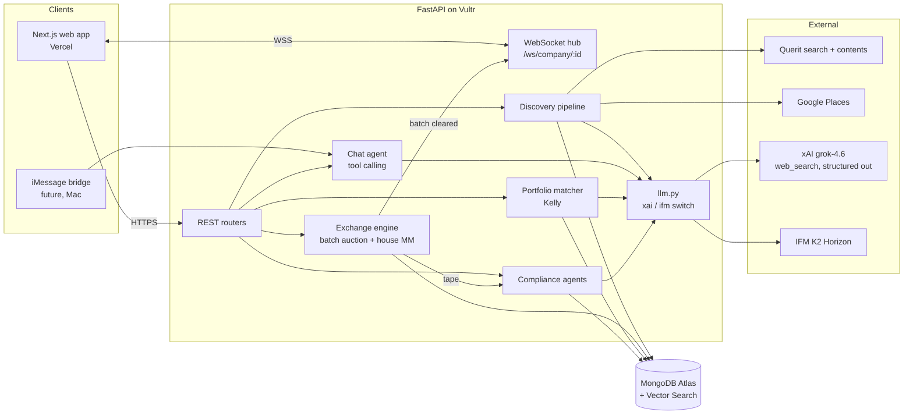
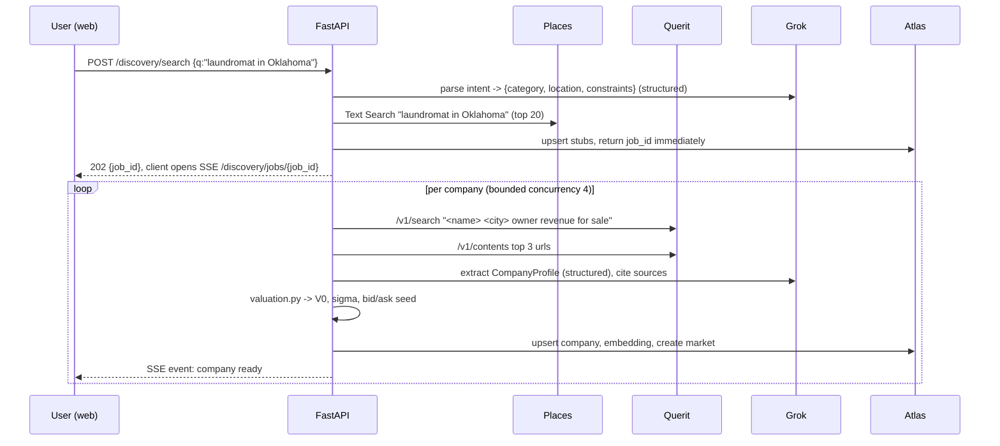

# JB: Plan.md

**HackCMU 2026 (Sep 11 to 12). Hacking starts Fri 9:00 PM, submissions due Sat 4:00 PM EDT (19 hours).**
**Team: Nico, Vir, Aditya, Zhiyuan.**

One line pitch: *a discovery engine and exchange for the businesses that will never be listed: laundromats, car washes, family manufacturers. Search them like Google, price them like a stock, buy a fraction like Robinhood, acquire them like a PE firm.*

This document is the steering doc. Every decision that changes an interface goes in `docs/DECISIONS.md` (see section 9). Everything in section 1 was checked against live sources on Sep 11, 2026; anything not verified is listed in 1.4.

---

## 0. Contents

1. What we know for certain (validated facts, tracks, prizes, sponsor APIs)
2. Which tracks and prizes to target, and why
3. Product: the two phases, user flows, screens
4. Stack, end to end
5. Architecture and network diagram
6. Data model (MongoDB)
7. API contract (the thing all four of us build against)
8. Pricing and market design (batch auction, house market maker, Kelly, Black-Scholes, anti arbitrage)
9. Agents, Grok integration, compliance surveillance
10. Splitting the work: two pairs (Nico + Aditya on the exchange, Vir + Zhiyuan on platform and discovery)
11. Hour by hour timeline
12. Agent to agent coordination across our four machines
13. Demo script (3 minutes)
14. Risks and cut lines

---

## 1. What we know for certain

### 1.1 Event facts (source: `HackCMU 2026 Opening Ceremony.pdf`, devpost pages)

| Fact | Value |
|---|---|
| Format | 24h, teams up to 4, "must be from scratch", any language or AI allowed |
| Hacking window | Fri 9:00 PM to Sat 4:00 PM (submit via Google form, plus Devpost) |
| Tracks | **Optimization**, **Traveling**, **Multiplayer**, **Food**, **IFM (optional)** |
| Track rule | Pick exactly one at submission, 50 word explanation. Relevance to track is a judged criterion |
| Judging criteria | Originality, Technical Difficulty ("real technical challenges vs ChatGPT wrapper"), Demo Quality (under 3 min), Usefulness, Relevance (track only) |
| Judging format | 3 min presentation + demo, 3 rooms of judges, expo tables |
| Prize categories | Grand (HRT poker set), Track 1st/2nd/3rd, IFM (Kindle), Cursor (Cursor keyboards), Sandia Cybersecurity (AirPods), People's Favorite, Best Design (Fujifilm), MLH: Gemini, ElevenLabs, Solana, Vultr, Auth0, MongoDB Atlas |
| Mentors | Live OH Sat 10am to 1pm TEP Simmons B, Discord tickets all night (fullstack, mobile, ML, cloud) |
| Workshops tonight | IFM workshop 9 to 10 PM TEP 1403 (K2 models). Cursor workshop 10 to 10:30 PM TEP 1403 (Cursor, Grok Imagine, Grok Bot) |
| Sponsors tabling | IFM, SpaceXAI (Grok, and per the slide, the company behind Cursor), Sandia, Querit, MLH |
| Discord | https://discord.com/invite/HP4BhW3hnp (slides posted there) |
| Schedule | https://www.acmatcmu.com/hackcmu2026/ |

Note on the rule "not permitted to start building or designing until the event": the event began at check in (5 PM). This plan was written after the opening ceremony. Keep all commits timestamped after 9 PM.

### 1.2 Sponsor APIs, validated

**Querit (web search for agents). This is the "query API" from the slide.**
- Docs: https://www.querit.ai/en/docs/overview/quickstart. SDK: `pip install querit` (https://github.com/querit-ai/querit-python). MCP server: https://github.com/querit-ai/querit-mcp
- Free tier: 1,000 searches/month, 1 QPS, no card. Paid: $4 per 1k searches, $1 per 1k pages.
- `POST https://api.querit.ai/v1/search`, header `Authorization: Bearer KEY`, body `{"query": "...", "count": 5, "filters": {"language": "english"}}`. Other params seen in the MCP tool: `include_domains`, `exclude_domains`, `date_range`, `countries`, `chunks_per_doc`, `include_content`.
- `POST https://api.querit.ai/v1/contents`, body `{"urls": [...], "format": "text|markdown|html", "crawlTimeout": 30, "extrasMeta": true}` (1 to 10 URLs per call).
- Response: `results[]` with `title`, `url`, `snippet`, page age, site name.

**xAI Grok API.**
- Base URL `https://api.x.ai/v1`, OpenAI compatible (use the `openai` Python/TS SDK with `base_url`), plus the `xai_sdk` package.
- Model to use: `grok-4.6` (500k context, $2 in / $6 out per 1M, $0.50 cached). Cheaper option if we burn credit: `grok-4.3` ($1.25 / $2.50).
- Responses API with server side tools: `tools=[{"type": "web_search", "filters": {"allowed_domains": [...max 5]}}]` and `{"type": "x_search"}`. Citations come back on the response (see Citations page in docs).
- Structured outputs: `chat.parse(PydanticModel)` in `xai_sdk`, or `response_format` JSON schema through the OpenAI client. Limits: 64 properties per object, 256 array items, 2,048 char strings.
- Also available if we want flair: Grok Imagine (images $0.04 each), voice API.

**IFM K2 Horizon (for the IFM prize).**
- Six Apache 2.0 models: 375B-A23B (MoE, 23B active, 512k context), 36B-A4B, 32B, 7B, 3.7B, 0.9B. Hugging Face org `IFM`.
- Served through partners (Cerebras, Nebius, AWS, Compass) with an OpenAI compatible chat endpoint; tool calling supported (json / xml formats via `chat_template_kwargs`); reasoning returned in `reasoning_content`.
- **Action tonight: one of us attends the 9 PM IFM workshop and gets the endpoint + key.** Everything LLM related in our code goes through one `llm.py` with a provider switch so K2 can take any role (see 9.4).

**MLH sponsors (each is a separate prize, cheap to qualify for).**
- MongoDB Atlas: free M0 cluster, $50 student credit at https://mlh.link/mongodb. Prize needs "a hack built on Atlas". We use Atlas + Atlas Vector Search.
- Auth0: https://mlh.link/auth0-signup, free to 7,000 users, no card. Prize needs "use any Auth0 API". One hour of work with the Next.js SDK.
- Vultr: https://mlh.link/vultr, free credits. Prize needs the hack deployed on Vultr. We deploy the API there.
- Gemini, ElevenLabs, Solana: skip (Gemini conflicts with the Grok story; Solana tokenized shares is a stretch idea only).

**Business data sources for discovery (validated).**
- Google Places API (New) Text Search: 5,000 free calls/month on Pro SKU, 10,000 on Essentials. Gives name, address, rating, review count, hours, phone, website. Best structured source for "laundromats in Tulsa, OK".
- Yelp Fusion: free tier is gone, 30 day trial with 5,000 calls. Backup only.
- BizBuySell (no API; use Querit search to find listings and Querit contents to read them). Public benchmarks for the valuation anchor: overall small business median sale price $349,250, cash flow (SDE) multiple 2.7x, revenue multiple 0.7x (Q2 2026 Insight Report). Laundromats 3x to 5x SDE single store, margins around 38%. Source pages: https://www.bizbuysell.com/learning-center/industry-valuation-multiples/ and https://www.bizbuysell.com/learning-center/valuation-benchmarks/laundromats-coin-laundry/

### 1.3 Market design references we are relying on (well known results, cited so the judges hear them)
- Frequent batch auctions: Budish, Cramton, Shim (2015), "The High-Frequency Trading Arms Race: Frequent Batch Auctions as a Market Design Response", QJE. Uniform price call auction every T seconds removes latency arbitrage and works with thin books.
- Market making with inventory risk: Avellaneda and Stoikov (2008), "High-frequency trading in a limit order book". Gives reservation price and spread as functions of volatility and inventory.
- Logarithmic market scoring rule: Hanson (2003). We borrow the idea of a house liquidity provider with bounded loss.
- Kelly (1956), and fractional Kelly for position sizing. Continuous form f* = mu / sigma^2.
- Black and Scholes (1973) for the acquisition option (right to buy 100% at a strike).

### 1.4 Not yet verified (check at the venue, first hour)
- Whether xAI gives hackathon credits (ask at the SpaceXAI table). Otherwise one of us puts $10 on a key; the whole hackathon costs under $5 at grok-4.6 prices.
- Exact IFM endpoint and key (workshop at 9 PM).
- Exact Cursor prize criteria (likely "built with Cursor"; ask at the table, and keep Cursor open on at least two machines with the repo).
- Sandia prize criteria (cybersecurity). Our surveillance agents and audit log are a plausible entry; ask what they want to see.
- xAI does not appear to offer an embeddings endpoint. Plan assumes local `sentence-transformers` (all-MiniLM-L6-v2, 384 dims) for company embeddings. Confirm at hack time; Gemini `text-embedding` is the fallback.
- Google Places needs a billing account attached even for free calls. One person sets this up with a personal card and a $5 budget cap.

---

## 2. Track and prize strategy

**Primary track: Optimization.** The core of the technical story is optimization at three levels:
1. The exchange clears each batch at the uniform price that maximizes executed volume (a 1D optimization solved exactly over the order book).
2. The house market maker sets quotes by minimizing inventory risk (Avellaneda Stoikov).
3. The portfolio builder sizes positions by maximizing expected log growth (Kelly) subject to budget and concentration limits, and matches companies to a user by vector similarity.

50 word track blurb (draft): *Small businesses have no price. We built an exchange that optimizes one: a frequent batch auction that clears each round at the volume maximizing price, a house market maker that minimizes inventory risk in thin markets, and a Kelly optimal portfolio builder that matches buyers to fractional stakes in businesses they discover.*

**Backup track: Multiplayer.** If, at 2 PM Saturday, the Optimization track looks crowded (ask organizers on Discord how many submissions per track), switch to Multiplayer. The exchange is inherently multiplayer; the demo where judges bid from their phones and watch the price clear works for either. Do not change the product; only change the 50 words.

**Sponsor prizes we are going for, in priority order:**
1. Cursor / SpaceXAI prize: Grok is doing real work in the app (extraction, valuation narrative, compliance reasoning, agent chat), and the code is written in Cursor.
2. IFM prize: K2 acts as the independent second reviewer in compliance and valuation (section 9.4). Real use, not decoration.
3. MongoDB Atlas: primary DB plus Atlas Vector Search for matching.
4. Auth0: login.
5. Vultr: API is deployed there.
6. Best Design: the frontend owner treats this as a goal from hour one.
7. Sandia Cybersecurity: audit log, surveillance agents, wash trade and spoofing detection. Pitch it if the table says it fits.

---

## 3. Product

### 3.1 The two phases

**Phase 1, Discover.** "I want a laundromat in Oklahoma." The pipeline finds real businesses (Places + Querit), reads about them (Querit contents + Grok web_search), extracts a structured profile (Grok structured output), estimates value with a distribution (section 8.2), and lists them with a bid, an ask, and a confidence. Each company page shows: what it does, founders/owners, location, estimated revenue and SDE with sources, valuation range, the live order book, price history, and an "Acquire" button.

**Phase 2, Trade and Acquire.** Every listed company is split into 10,000 shares. Users place limit orders (fractional allowed, 0.01 share min). A batch auction clears every 10 seconds (demo setting; 30s to 60s in "real" mode). The house market maker guarantees there is always a bid and an ask. "Acquire" opens a flow: a Grok drafted letter of intent and a due diligence checklist specific to the state and business type with citations. (Backup feature, only if ahead of schedule: a Black Scholes priced acquisition option, pay a premium now for the right to buy 100% at a strike within 90 days.) A portfolio tab suggests other stakes with Kelly sized amounts. A surveillance panel shows what the compliance agents flagged this session.

### 3.2 Screens (Next.js routes)

| Route | Purpose | Key components |
|---|---|---|
| `/` | Landing + search bar ("laundromat in Oklahoma") + trending companies | SearchBar, TrendingGrid |
| `/search?q=` | Results list with bid / ask / last / confidence, filters (state, category, price band) | ResultCard, FilterRail, progress stream while the pipeline runs |
| `/company/[id]` | Profile, valuation with sources, order book, chart, order ticket, acquire button | ProfileHeader, ValuationCard (range bar), OrderBook (live), PriceChart, OrderTicket, SourcesList |
| `/company/[id]/acquire` | LOI draft, DD checklist (option quote is a backup add on) | LoiEditor, ChecklistAccordion, OptionQuote (backup) |
| `/portfolio` | Holdings, P&L, Kelly suggestions, "build me a portfolio" | HoldingsTable, SuggestionCards, RiskSlider |
| `/surveillance` | Flags feed, per batch summary, audit log search | FlagsFeed, BatchTimeline |
| `/agent` | Chat with the discovery/trading agent (same backend the iMessage bridge will use) | Chat, tool call cards |

Design direction for the Best Design prize: one accent color, dark trading UI for company pages, light editorial UI for discovery, monospace numerals, no stock photos. Bid in green, ask in red, clearing price in the accent color, and the countdown to next batch always visible on the company page.

---

## 4. Stack

Chosen for: four people in parallel, 19 hours, Python for the quant code, a UI that can win Best Design, sponsor prizes with near zero extra cost.

| Layer | Choice | Why |
|---|---|---|
| Frontend | Next.js 15 (App Router), TypeScript, Tailwind, shadcn/ui, `lightweight-charts` (TradingView) for price, Recharts for the rest | Fast to build, looks good by default, Vercel deploy in minutes |
| Auth | Auth0 via `@auth0/nextjs-auth0` | MLH prize, one hour |
| API | Python 3.12, FastAPI, Pydantic v2, `uvicorn`, WebSockets | Quant code (numpy, scipy) lives in Python; one process, one deploy |
| Realtime | FastAPI WebSocket endpoint, in process pub/sub (one uvicorn worker) | No Redis needed for a demo |
| DB | MongoDB Atlas M0, `motor` (async driver), Atlas Vector Search index on `companies.embedding` | Team's choice; MLH prize; vector search is built in |
| LLM | `openai` SDK pointed at `https://api.x.ai/v1` (grok-4.6), and at the IFM K2 endpoint. One `llm.py` with `provider="xai" \| "ifm"` | OpenAI compatible on both sides |
| Search | Querit (`querit` SDK) for web search + page contents; Google Places (New) Text Search for structured business listings | Sponsor API plus the best free structured source |
| Embeddings | `sentence-transformers` all-MiniLM-L6-v2 (local, 384 dims) | No key, no cost; fallback Gemini embeddings |
| Deploy | Frontend on Vercel; API on a Vultr VPS (Docker, `docker compose up`) | Vultr prize; Vercel is free |
| Repo | Monorepo `JB/` with `apps/web`, `apps/api`, `packages/contracts`, `docs/` | One clone, one CLAUDE.md, one contract folder |
| Dev tooling | Cursor on every machine, Claude Code on every machine, `uv` for Python, `pnpm` for web | Cursor prize; agents coordinate through the repo (section 12) |

Repo layout:

```
JB/
  CLAUDE.md                  # loaded by every Claude Code session; points to docs/
  .cursor/rules/steering.mdc # same content for Cursor
  docs/
    STEERING.md              # this plan, kept current
    DECISIONS.md             # append only decision log (who, when, what changed, who is affected)
    API.md                   # generated from FastAPI /openapi.json
  packages/contracts/
    openapi.yaml             # frozen at 11:30 PM Friday; changes need a DECISIONS entry
    types.ts                 # generated with openapi-typescript
  apps/api/
    app/main.py
    app/llm.py               # provider switch: xai | ifm
    app/routers/{discovery,companies,market,portfolio,acquire,agent,surveillance}.py
    app/services/discovery/  # querit.py places.py extract.py valuation.py
    app/services/market/     # book.py auction.py mm.py kelly.py options.py
    app/services/agents/     # compliance.py portfolio_agent.py chat_agent.py
    app/db.py
    seeds/                   # cached discovery results so the demo never waits on the network
    tests/                   # auction and Kelly unit tests (cheap, and judges like seeing them)
  apps/web/                  # Next.js
  scripts/
    imessage_bridge.py       # future: Mac chat.db poller + osascript sender
```

---

## 5. Architecture



Request flow for a search:



---

## 6. Data model (MongoDB)

```
users        { _id, auth0_sub, name, cash: 100000, risk_profile: {tolerance, horizon, sectors[], states[], budget}, created_at }
companies    { _id, name, category, naics_guess, address, city, state, lat, lng, website, phone,
               rating, review_count, founded_year, owners[], description,
               financials: { revenue_est, sde_est, margin_est, employees_est, confidence 0..1, method },
               valuation: { v0, sigma, low, high, multiple_used, comps[], as_of },
               sources[]: { url, title, snippet, fetched_at },
               embedding: [384 floats], status: "stub"|"ready"|"failed", created_at }
markets      { _id: company_id, shares_outstanding: 10000, tick: 0.01, last_price, ref_price,
               batch_interval_s: 10, next_batch_at, band_pct: 0.10,
               mm: { inventory, cash, gamma, k, sigma, max_depth }, halted: false }
orders       { _id, market_id, user_id, side: "buy"|"sell", qty, limit_price, status: "open"|"filled"|"partial"|"cancelled",
               filled_qty, created_at, cancelled_at, origin: "user"|"mm"|"agent" }
batches      { _id, market_id, t, clearing_price, volume, imbalance, n_buy, n_sell, book_snapshot: {bids[], asks[]} }
trades       { _id, market_id, batch_id, buyer_id, seller_id, qty, price, t }
positions    { _id, user_id, market_id, qty, avg_cost }
options      { _id, market_id, holder_id, strike, expiry, premium, sigma_used, status }
acquisitions { _id, market_id, user_id, loi_md, checklist[], status }
flags        { _id, market_id, batch_id, rule, severity, subjects[], explanation, reviewer: "rules"|"grok"|"k2", t }
audit_log    { _id, t, actor, action, payload_hash, payload }   # append only, never updated
```

Indexes: `companies` text index on `name, description, category`; vector index `company_vec` on `embedding` (cosine, 384); `orders` on `(market_id, status)`; `trades` on `(market_id, t)`.

---

## 7. API contract (freeze by 11:30 PM Friday)

All JSON, all under `/api/v1`. Auth: Auth0 access token in `Authorization: Bearer` on anything that writes. Demo mode flag `DEMO_AUTH=1` accepts `X-Demo-User: <name>` so judges can trade from phones without logging in.

**Discovery**
- `POST /discovery/search {q}` -> `202 {job_id, intent}`
- `GET /discovery/jobs/{id}` (SSE) -> events `company_ready {company}`, `done`
- `GET /companies?state=&category=&q=&sort=` -> `[CompanyCard]`
- `GET /companies/{id}` -> `Company` (profile + valuation + sources + market summary)
- `POST /companies/{id}/refresh` -> rerun extraction (admin)

**Market**
- `GET /markets/{id}/book` -> `{bids:[{price,qty}], asks:[...], last, ref, next_batch_at, band}`
- `POST /markets/{id}/orders {side, qty, limit_price}` -> `Order`
- `DELETE /orders/{id}`
- `GET /markets/{id}/batches?limit=` -> `[Batch]` (price history)
- `GET /markets/{id}/trades?limit=`
- `WS /ws/markets/{id}` -> pushes `book`, `batch`, `trade`, `flag` events
- Backup, not in the frozen contract until we are ahead: `POST /markets/{id}/options/quote {strike, days}` -> `{premium, d1, d2, sigma, r}` and `POST /markets/{id}/options/buy`

**Portfolio**
- `GET /portfolio` -> `{cash, positions[], pnl}`
- `PUT /portfolio/profile {tolerance, horizon, sectors[], states[], budget}`
- `POST /portfolio/suggest` -> `[{company, edge, sigma, kelly_fraction, suggested_usd, why}]`

**Acquire**
- `POST /acquire/{company_id}/start` -> `{acquisition_id, loi_md, checklist[]}`
- `POST /acquire/{id}/chat {message}` -> streamed reply (edits LOI, answers DD questions, cites)

**Agent**
- `POST /agent/chat {session_id, message}` -> streamed reply; tools: `search_companies`, `get_company`, `get_book`, `place_order`, `suggest_portfolio`. Same endpoint the iMessage bridge calls later.

**Surveillance**
- `GET /surveillance/flags?since=`
- `GET /surveillance/audit?actor=&since=`

Pydantic models live in `apps/api/app/schemas.py`; `packages/contracts/openapi.yaml` is exported from `/openapi.json`; `types.ts` generated with `pnpm openapi-typescript`. If you change a schema, regenerate both and add a line to `docs/DECISIONS.md`.

---

## 8. Pricing and market design

The problem: 56 bidders (or fewer) per asset, no history, no fundamentals on file. A continuous limit order book would be empty most of the time and trivially manipulable. Design principles: one price per batch, always a counterparty, prices anchored to a valuation with an honest uncertainty, and bounded house loss.

### 8.1 Units
Each company has 10,000 shares. Price per share `p = V / 10000`. Fractional shares to 0.01. Tick 0.01 USD. Users start with 100,000 play dollars.

### 8.2 Valuation anchor `V0` and uncertainty `sigma`
`valuation.py` returns a lognormal belief `ln V ~ N(ln V0, sigma^2)`.

1. Grok extracts, with sources: `revenue_est`, `sde_est` (seller's discretionary earnings), `employees_est`, `years_operating`, `rating`, `review_count`, `owner_operated`, and a `confidence` in [0,1]. If financials are absent, Grok estimates from proxies and says so (`method: "proxy"`), using category medians we hard code from BizBuySell (revenue per employee, SDE margin).
2. Multiple by category (hard coded table, cite BizBuySell): laundromat 4.0x SDE (range 3 to 5), restaurant 2.0x, auto repair 2.5x, car wash 3.5x, manufacturing 3.0x, default 2.7x. Adjust +0.5 for rating >= 4.5 with review_count >= 100, -0.5 if owner operated with no manager mentioned, +/- for years operating.
3. `V0 = multiple * sde_est`, floor at `0.7 * revenue_est` when SDE is a proxy estimate.
4. `sigma = 0.15 + 0.6 * (1 - confidence)`, clipped to [0.15, 0.75]. A company with tax returns online is 15% uncertain; a Places stub with no web presence is 75%.
5. Seed the book: `low = V0 * exp(-sigma)`, `high = V0 * exp(+sigma)` shown as the valuation range; the house market maker's initial bid/ask straddle V0 (8.4).
6. Belief update after trading: precision weighted blend of the prior and the volume weighted batch prices, `V_post = (V0/s0^2 + sum(w_i p_i)/s_m^2) / (1/s0^2 + 1/s_m^2)`, and `sigma` decays toward realized vol over the last 20 batches. Displayed as "market implied value" next to "model value".

### 8.3 Frequent batch auction (the exchange)
Every `T` seconds (10 in demo, configurable per market), take all open limit orders plus the house quotes and compute the uniform clearing price:

```
demand(p) = sum of buy qty with limit >= p
supply(p) = sum of sell qty with limit <= p
p* = argmax_p min(demand(p), supply(p))           # maximize executed volume
ties: minimize |demand(p) - supply(p)|, then pick p closest to last_price, then midpoint
```

Candidates for `p` are the set of limit prices in the book, so this is an exact scan over at most a few hundred prices. Fill at `p*`: every buy with limit >= p* and every sell with limit <= p* executes at `p*` (price improvement for aggressive orders, no price discrimination); the short side fills fully, the long side is rationed pro rata by qty (time priority as a tiebreak). Unfilled orders stay in the book for the next batch. Post the batch to `batches`, the trades to `trades`, push over the WebSocket, and hand the tape to the compliance agents.

Why this and not a continuous book: with tens of participants the book is sparse, and continuous matching lets the fastest participant pick off stale quotes. A uniform price auction has no speed advantage, gives one fair price per round (easy to show and explain in 3 minutes), and is exactly the "optimize something" the track asks for.

Low volume tuning: `T` grows with sparseness (`T = clamp(10 * 20 / max(n_orders, 1), 10, 60)` seconds), so a dead market clears once a minute and an active one every 10 seconds. The countdown is shown in the UI.

### 8.4 House market maker (there is always a counterparty)
The house posts a ladder of bids and asks into every batch, generated from Avellaneda Stoikov with the valuation belief:

```
s      = current mid belief (V_post / 10000)
q      = house inventory in shares (positive = long)
gamma  = risk aversion (0.1 demo), k = order arrival intensity (1.5), tau = 1 (one "day" horizon)
r      = s - q * gamma * sigma_p^2 * tau                 # reservation price, skews against inventory
delta  = gamma * sigma_p^2 * tau + (2/gamma) * ln(1 + gamma/k)   # total spread
bid_1  = r - delta/2, ask_1 = r + delta/2
ladder = 5 levels each side, price step = delta/2, qty at level i = D * exp(-0.5 i) where D = base depth in shares
```

`sigma_p` is the per batch price vol implied by the belief `sigma`. Depth `D` scales with confidence (a well documented business gets deep quotes, a stub gets thin ones). The house has an inventory cap (+/- 15% of shares); at the cap it quotes one side only. House PnL is tracked and shown on the surveillance page as "liquidity provider P&L", which is also the bound on how much the platform can lose per company (this is the LMSR idea: bounded subsidy in exchange for liquidity).

### 8.5 Anti arbitrage and fairness rules (enforced in `book.py`, tested)
- Uniform price per batch, no order sees a different price than another in the same round.
- Price band: the clearing price cannot move more than `band_pct` (10%) from the previous clearing price in one batch; if the optimum is outside the band, clear at the band edge with rationing and flag `volatility_halt_candidate`. Two consecutive band hits halt the market for one batch (auction resumes with a wider band).
- Self trade prevention: a user's buys and sells never match each other; the later order is cancelled.
- Order limits: max qty per order 5% of shares, max open notional per user per market 25% of their cash.
- Server timestamps only, orders are immutable once placed (cancel creates a new event), everything mirrored to `audit_log`.
- The house never trades against its own quotes and its ladder is recomputed only between batches (no look ahead at the current round's orders).
- Limit prices are clamped to [0.5x, 2x] of the reference so fat fingers do not print absurd prices.
- If options are built (8.7, backup), exercise settles at the batch price, not at a user chosen price.

### 8.6 Kelly sizing for the portfolio builder
For a candidate company with market price `p`, model value `v = V_post / 10000`, and belief vol `sigma`:

```
mu    = ln(v / p)                       # expected log return if price converges to value
f*    = mu / sigma^2                    # continuous Kelly fraction of bankroll
f     = clamp(0.5 * f*, 0, 0.20)        # half Kelly, cap 20% per name
usd   = f * bankroll
```

Across N suggestions, treat covariance as diagonal (thin markets, no shared history), so the vector is elementwise, then rescale so the sum is at most 80% of budget. Show the user `edge`, `sigma`, `f`, and one sentence from Grok on why this company matches their profile. Negative `mu` means "overpriced", shown as a sell candidate if they hold it. A risk slider maps to the Kelly multiplier (0.25 to 1.0).

Matching before sizing: candidate set = Atlas Vector Search top 30 on the embedding of the user's profile text (sectors, states, horizon, free text) filtered by state and budget, minus companies they already hold.

### 8.7 Black Scholes for acquisition options (BACKUP: build only after the feature freeze checklist in section 11 is green)
An acquisition option is the right to buy 100% of the company (all 10,000 shares) at strike `K` (per share) within `T` days. Treat the company value as the lognormal underlying with vol `sigma` from the belief (annualized), `r = 0.04`:

```
d1 = (ln(S/K) + (r + sigma^2/2) T) / (sigma sqrt(T)),   d2 = d1 - sigma sqrt(T)
C  = S N(d1) - K e^{-rT} N(d2)         # premium per share, times 10000 for the whole company
```

On exercise, the holder buys all outstanding shares at `max(K, last batch price)` from every holder (a forced tender at a price no worse than market; minority holders are protected). This is also where the "legal" flow attaches: exercising generates the LOI and the checklist. If options trade, their prices give an implied `sigma` we feed back into the market maker (8.4). Kept simple on purpose: European exercise, no dividends, cash settled in play money.

### 8.8 What to unit test (30 minutes, high payoff in judging)
- Auction: given a hand written book, `p*` and fills match a worked example; pro rata rationing sums correctly; band clamp works.
- Market maker: skew sign flips with inventory sign; spread grows with sigma.
- Kelly: f = 0 when p = v; cap respected.
- Black Scholes (only if 8.7 is built): C(K -> 0) -> S, C(sigma -> 0) -> max(S - K e^{-rT}, 0).

---

## 9. Agents and Grok integration (use the model, do not code with it)

All calls go through `llm.py`:

```python
def complete(messages, *, provider="xai", model=None, schema: type[BaseModel] | None = None, tools=None, web_search=False)
```

### 9.1 Discovery extractor (Grok, structured output)
System prompt: an analyst filling a `CompanyProfile` from raw page text; must cite a source URL for every numeric field or mark it `estimated`. Input: Places record + Querit snippets + up to 3 page contents (truncated to 6k tokens each). Output: the Pydantic model in 6. Then `valuation.py` runs (no LLM in the math).

For a company with almost no web presence, a second call uses `tools=[{"type":"web_search"}]` on grok-4.6 to look for a BizBuySell or LoopNet listing, owner name, and news, with `allowed_domains` on the first pass (bizbuysell.com, loopnet.com, bizquest.com, yelp.com, facebook.com) and open on the second.

### 9.2 Discovery intent parser (Grok, structured)
"Kerosene manufacturers in Oklahoma under 2M" -> `{category, naics_guess, state, city?, max_value, min_value, must_have[]}`. Feeds both Places (text query) and Querit (query expansion into 3 queries).

### 9.3 Portfolio agent (Grok)
Given the user's profile and the top matches from vector search plus Kelly numbers, write one sentence per company on fit, and a 3 sentence portfolio summary. Pure narrative on top of deterministic numbers, so the numbers stay auditable.

### 9.4 Compliance surveillance (rules first, Grok second, K2 as independent reviewer)
Runs after every batch on the tape (`orders`, `trades`, `batches` for that market, last 20 batches).

Deterministic detectors (`compliance.py`, no LLM):
- Wash trading: same user on both sides within 3 batches, or two accounts that only ever trade with each other.
- Spoofing / layering: user places >= 3 orders away from mid that are cancelled before the batch, repeated >= 2 rounds, while trading the other side.
- Pump: clearing price moves > 2 sigma_p in a batch with > 60% of buy volume from one user.
- Band abuse: repeated orders at the band edge.
- Concentration: one user > 40% of shares.

Each hit becomes a `flag` with `reviewer: "rules"`. Then Grok gets the flag plus a compact tape excerpt and writes the explanation a human compliance officer would write, sets `severity`, and may downgrade to `benign` with a reason. K2 (IFM) receives the same packet independently; if the two models disagree on severity, the flag is marked `disputed` and shown with both opinions. This is the honest use of two model families: an ensemble on a judgment call, not a decoration. The UI feed shows the flag, the rule, and both reviewers.

Stretch (only if there is time after 12 PM Saturday): a free running Grok agent with read only tools over the audit log that publishes a "market health" note every 5 minutes.

### 9.5 Chat agent (Grok tool calling; web now, iMessage later)
Tools: `search_companies(q)`, `get_company(id)`, `get_book(id)`, `place_order(id, side, qty, limit)`, `suggest_portfolio()`. Conversation state keyed by `session_id`. Responses are plain text with short lines so they read well in iMessage.

**iMessage plan (post hackathon, designed now).** No official Apple API. Two routes:
1. Zero cost, on a Mac we own: poll `~/Library/Messages/chat.db` (SQLite) for new rows in `message` joined to `handle`, call `POST /agent/chat` with `session_id = phone number`, send replies with `osascript -e 'tell application "Messages" to send ... to buddy ...'`. Needs Full Disk Access for the terminal. This is `scripts/imessage_bridge.py`.
2. Hosted: Sendblue (about $100/mo), Blooio ($39/mo) give a REST API and webhooks for inbound. Same `/agent/chat` endpoint, a webhook handler instead of the poller.
Because the agent endpoint is transport agnostic, the bridge is under 100 lines either way.

### 9.6 Acquisition and legal flow (Grok with web_search, grounded)
`POST /acquire/{id}/start` produces: (a) an LOI in markdown with the blanks filled from the profile (price from the last batch, structure asset purchase, 45 day diligence period, non binding), and (b) a due diligence checklist specific to `state` and `category`, each item with a citation from `web_search` (for example, Oklahoma sales tax permit transfer, lease assignment consent, equipment liens via UCC search, environmental for dry cleaners, health permits for food). A disclaimer line: play money, not legal advice. The chat endpoint edits the LOI in place.

---

## 10. Splitting the work: two pairs

Assigned at 9 PM by strength. Nico and Aditya are the finance people, so they own everything that prices or clears. Vir and Zhiyuan own everything that finds, stores, and serves. The old role D (agents and platform) is dissolved and its pieces are folded into whichever pair already owns the data those agents read.

Ownership is at the **file** level inside a pair and at the **directory** level between pairs. Nobody edits the other pair's directory without a DECISIONS entry. Inside a pair, the two owners must not edit each other's files either; that is what the hour 1 interface freeze below is for.

### The market pair — Nico + Aditya

Owns `app/services/market/`, `app/routers/market.py`, the WebSocket hub, `app/services/agents/compliance.py`, `app/services/agents/portfolio_agent.py`, and `tests/`.

**Nico — the engine. Deterministic, no LLM, no network.**
Hours 0 to 3: `book.py` and `auction.py` as pure functions with unit tests, including the 8.5 anti arbitrage and fairness rules. Hours 3 to 7: Mongo persistence for orders, fills, and the tape; the asyncio batch scheduler (one task per market); the WebSocket hub that broadcasts the batch event. Hours 7 to 11: order endpoints in `routers/market.py`, `create_market(company)` for the platform pair to call, halt and band enforcement. Hours 11 to 16: correctness pass under load, idempotent replay, reconciliation of positions and cash. Hours 16 to 19: freeze, then help rehearse the market half of the demo.

**Aditya — pricing, strategy, and surveillance. Consumes Nico's engine, never edits it.**
Hours 0 to 3: `mm.py` against a fake in memory book, so this starts before the engine exists: reservation price from the belief, inventory skew, spread from `gamma` and `k`. Hours 3 to 7: belief update from clearing prices, seeded by `V0` and `sigma` from Zhiyuan's `valuation.py`. Hours 7 to 11: `kelly.py` plus `portfolio_agent.py` (vector search candidates in, sized stakes and one sentence of narrative out). Hours 11 to 15: `compliance.py`, the wash trade and layering rules over the tape, then Grok and K2 as the two independent reviewers. Hours 15 to 19: bot traders (50 fake users on a random walk around `V0`, which is also the demo's other bidders), then tune `gamma`, `k`, `T`. `options.py` only if the 1 PM checklist is green.

**Interface frozen in hour 1, before either of them is blocked on the other:**

```python
clear_batch(orders: list[Order], prev_price: Decimal) -> BatchResult   # Nico owns, pure
quote(belief: Belief, inventory: int, params: MMParams) -> list[Order] # Aditya owns, pure
```

Both are pure functions over `packages/contracts` types, so Aditya develops against a fake book and Nico develops against random order flow. They meet only at the scheduler, which is Nico's.

### The platform pair — Vir + Zhiyuan

Owns `apps/web/`, `packages/contracts/`, `app/services/discovery/`, `app/routers/{discovery,companies,agent,acquire}.py`, `app/db.py`, `app/llm.py`, `seeds/`, and deploy.

**Vir — platform, then product surface.**
Hours 0 to 3, and this is the whole team's critical path, so nothing else starts until it lands: monorepo scaffold, `packages/contracts` with `openapi.yaml` and `types.ts`, `.env.example` and every key collected (xAI, IFM, Querit, Places, Atlas, Auth0, Vultr), `docker-compose.yml`, skeleton API deployed to Vultr with `GET /health` green, demo auth header, `llm.py` with the xai and ifm switch, and the coordination layer from section 12 (`CLAUDE.md`, `.cursor/rules/steering.mdc`, `docs/DECISIONS.md`, the Claude Code hooks). Hours 3 to 5: Next.js scaffold, design tokens, shadcn/ui component library, and the mock JSON in `packages/contracts/examples/` so the UI is never blocked on a real backend. Hours 5 to 14: `/`, `/search` with the streaming result list, and the profile half of `/company/[id]` (header, valuation range bar, sources). Hours 14 to 19: mobile layout (judges bid from their phones), Devpost page, deploy, rehearsal.

**Zhiyuan — discovery and the database.**
Hours 0 to 2: `querit.py` and `places.py` clients, the Grok intent parser, and the `CompanyProfile` schema, which is the single most contended type in the repo and must be in the contract by 11:30 PM. Hours 2 to 7: `extract.py` with Grok structured output and a source URL on every numeric field, `valuation.py` producing `V0` and `sigma`, embeddings, Mongo collections and indexes, Atlas Vector Search index, the SSE job endpoint. Hours 7 to 11: run the 8 seed queries and cache 60 companies in `seeds/`, so the demo never waits on the network. Hours 11 to 16: extraction quality passes, the Grok `web_search` fallback for thin companies, refresh endpoint. Hours 16 to 19: `chat_agent.py` and the acquire LOI if the schedule is green, both of which are cut candidates.

**The trading UI belongs to Aditya, not to Vir.** `OrderBook`, `OrderTicket`, `PriceChart`, and the depth view are thin React over a WebSocket feed, and the person who designed the microstructure is the one who knows what they should show. Vir owns the design tokens and the component library; Aditya composes from them and writes no raw CSS. This is the one deliberate exception to directory ownership, and it exists so that `apps/web` does not become a single person bottleneck at hour 12.

### The only cross pair dependencies

1. `create_market(company)` — Nico writes it, Zhiyuan calls it on company upsert. Stub returning a fixed id by hour 1.
2. `V0` and `sigma` — Zhiyuan's `valuation.py` produces them, Aditya's `mm.py` consumes them as the belief prior. Freeze the shape in hour 1; Aditya uses a constant until they are real.
3. `packages/contracts/examples/*.json` — both pairs commit mocks in hour 1, and the frontend builds against those until the contract freeze at 11:30 PM.

Everything else is in process Python inside one FastAPI app, and compliance reads the tape through Mongo rather than through Nico's code, so there is no coupling there.

### Sleep

Stagger **across** pairs, not within them, so both the exchange and the pipeline always have one awake owner: Nico and Zhiyuan sleep 3 to 6 AM, Aditya and Vir sleep 5:30 to 8:30 AM. Everyone is up for the 8 AM integration.

---

## 11. Timeline (Fri 9 PM to Sat 4 PM)

| Time | Milestone |
|---|---|
| 9:00 PM | Roles chosen, repo cloned on 4 machines, D at IFM workshop, keys collected. Everyone: `uv sync`, `pnpm i`, `.env` filled |
| 10:00 PM | One person at Cursor workshop (ask about prize criteria). Others: scaffolds up, `GET /health` deployed on Vultr |
| 11:30 PM | **Contract freeze.** `openapi.yaml`, `types.ts`, example JSON committed. DECISIONS.md entry 001 |
| 1:00 AM | Vertical slice on mocks: search page renders seeds, company page shows a book, order ticket posts, auction clears in a test |
| 3:00 AM | Real discovery end to end for one query. Real auction with WebSocket updates. Compliance rules run on the tape |
| 3:00 to 8:30 AM | Sleep staggered across pairs: Nico + Zhiyuan 3 to 6, Aditya + Vir 5:30 to 8:30. Both services always have one awake owner |
| 8:00 AM | Integration: seeds loaded, house MM live, portfolio suggest returns numbers, acquire returns an LOI |
| 10:00 AM to 1:00 PM | Mentor OH open. Fix the ugliest thing. Bot traders running so markets look alive |
| 1:00 PM | **Feature freeze.** Only bugs and polish after this |
| 1:30 PM | Demo rehearsal 1 (timed). Devpost draft: title, 50 word track text, screenshots, repo link, sponsor tech list |
| 2:30 PM | Rehearsal 2. Decide track (Optimization unless Discord suggests otherwise). Final Vultr + Vercel deploy, seeds reloaded |
| 3:30 PM | Submit Google form + Devpost. Do not touch prod after this |
| 4:00 PM | Deadline. Expo table setup: laptop on company page with live batches, QR code to the site so judges can bid |

---

## 12. Agent to agent coordination across four machines

Every one of us runs Claude Code and Cursor on our own laptop. The coordination layer is the repo itself, which is the only thing all four agents can see. Three pieces:

**1. `CLAUDE.md` at the repo root (auto loaded by every Claude Code session).** Contents:

```
# JB (HackCMU 2026)
Read docs/STEERING.md once per session, and docs/DECISIONS.md every time before you change a schema, route, or shared type.
Before starting work: git pull --rebase.
Ownership: services/market + routers/market.py + compliance.py + portfolio_agent.py = Nico & Aditya (market pair). apps/web + packages/contracts + services/discovery + db.py + llm.py + deploy = Vir & Zhiyuan (platform pair). Do not edit the other pair's directory; instead append a request to docs/DECISIONS.md. Inside a pair, see Plan.md section 10 for the file level split.
Any change to packages/contracts, app/schemas.py, or db collections requires: (1) an entry in docs/DECISIONS.md with id, time, author, what changed, who must react; (2) regenerate openapi.yaml and types.ts; (3) commit with prefix "contract:".
Commit small and often to your own branch (nico/, aditya/, vir/, zhiyuan/ prefixes); merge to main only when tests pass. Never force push main.
Keys live in .env (never committed). .env.example lists every variable.
```

`.cursor/rules/steering.mdc` carries the same text (`alwaysApply: true`) so Cursor sessions get it too.

**2. `docs/DECISIONS.md`, append only.** Format:

```
## 007  Sat 02:10  author: Nico  affects: Vir, Aditya
Batch event now includes `imbalance` and `book_snapshot`. Frontend can draw the depth chart from it; compliance can drop its own snapshot query.
Migration: none, additive.
```

**3. Claude Code hooks in `.claude/settings.json` (committed).**
- `SessionStart`: `git pull --rebase --autostash && tail -n 40 docs/DECISIONS.md` so every new session begins with the latest decisions in context.
- `PostToolUse` on Edit/Write matching `packages/contracts/**` or `app/schemas.py`: prints a reminder to add a DECISIONS entry and regenerate types.
- Optional: a `Stop` hook that runs `git status --short` so nobody ends a session with uncommitted contract changes.

Plus one human channel: a `#jb-decisions` Discord channel (or group chat) where the DECISIONS entry number is posted so the other three pull. If we want it automatic, a `post-commit` git hook curls a Discord webhook with the commit message when it starts with `contract:`.

This is deliberately low tech. A shared markdown log that every agent reads at session start beats any real time bus for a 19 hour project, and it doubles as the changelog judges can read.

---

## 13. Demo script (3 minutes)

0:00 The problem. "There are 33 million small businesses in the US and none of them has a price. If you wanted to buy a laundromat in Tulsa tonight you could not even find the list."
0:20 Type "laundromat in Oklahoma". Results stream in with bid, ask, confidence. Point at the Querit and Grok pipeline in one sentence.
0:50 Click one. Profile with sources, valuation range, the live order book, countdown. "Every ten seconds we run a uniform price auction and clear at the volume maximizing price. There is always a counterparty because the house market maker quotes from the valuation belief with inventory skew."
1:20 Judges scan the QR and place bids from phones. Batch clears, price moves, chart ticks. Bot traders keep it alive.
1:50 Portfolio tab. "Given your profile, here are four stakes sized by half Kelly." One sentence on the math.
2:10 Acquire. LOI draft and Oklahoma specific diligence checklist with citations (option quote if built).
2:35 Surveillance. A planted wash trade from the bot gets flagged; Grok explains it, K2 concurs. "Two model families, independent review."
2:50 Stack slide: Next.js, FastAPI, MongoDB Atlas Vector Search, Auth0, Vultr, Querit, Grok, K2, built in Cursor. Track: Optimization.

---

## 14. Risks and cut lines

| Risk | Mitigation | Cut line if behind |
|---|---|---|
| Live discovery is slow (Querit 1 QPS + Grok) | Seed 60 companies at 6 AM; live query only for the demo's one search; SSE streams partial results | Demo from seeds only |
| Grok credits unavailable | Ask at the table; personal key with $10 cap; grok-4.3 for extraction | Extractor falls back to K2 or a smaller model |
| IFM endpoint unclear | Get it at the workshop; else run K2-Horizon-7B on a Vultr GPU with vLLM, or drop the second reviewer | Compliance uses Grok only; still pitch IFM at the table honestly |
| Market looks dead in demo | Bot traders (50 fake users, random walk around V0) started at 1 PM | Manual bids from 4 phones |
| Auth0 eats an hour | Demo auth header from minute one; Auth0 only on the landing page login button | Keep demo auth |
| Vector search index not building on M0 | Local cosine over 60 embeddings in numpy | Fine at this scale |
| Acquisition flow too much | LOI is one Grok call; checklist is one more | Keep LOI only |
| Acquisition options (8.7) | Backup feature by decision on Sep 11. Build only if section 11 is on schedule at 1 PM | Not built; mention as roadmap |
| iMessage | Not in scope for the hackathon; mention as next step | n/a |
| Solana, ElevenLabs, Gemini | Not attempted | n/a |

First thing tomorrow morning if everything works: the free running surveillance agent (9.4 stretch) and the market health note, because it is the most visible "agents watching the exchange" moment and it costs one asyncio loop.
